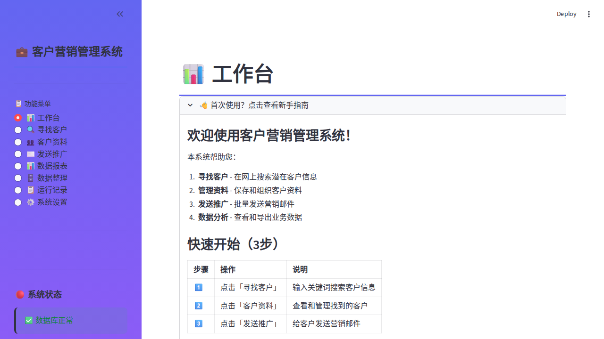

# Web Dashboard E2E 测试报告

**测试时间**: 2026-01-09 14:38:36
**工作区**: work-ui (feature/web-ui-v3)
**测试类型**: 完整功能测试 + 截图验证

---

## 测试结果概览

| 指标 | 结果 |
|------|------|
| 总页面数 | 8 |
| 通过 | 8 ✅ |
| 失败 | 0  |
| 通过率 | 100.0% |
| 侧边栏平均宽度 | 300px |
| 侧边栏状态 | 全部展开 ✅ |
| Radio菜单状态 | 全部可见 ✅ |

---

## 功能页面详情

### 1. ✅ 📊 系统概览

| 项目 | 结果 |
|------|------|
| 状态 | 通过 ✅ |
| 侧边栏宽度 | 300px |
| 侧边栏状态 | 展开 |
| Radio选项数 | 8 |
| 菜单可见性 | 可见 |
| 截图 | [20260109_143751_系统概览.png](./20260109_143751_系统概览.png) |



---

### 2. ✅ 🕷️ 数据爬取

| 项目 | 结果 |
|------|------|
| 状态 | 通过 ✅ |
| 侧边栏宽度 | 300px |
| 侧边栏状态 | 展开 |
| Radio选项数 | 8 |
| 菜单可见性 | 可见 |
| 截图 | [20260109_143751_数据爬取.png](./20260109_143751_数据爬取.png) |


---

### 3. ✅ 👥 联系人管理

| 项目 | 结果 |
|------|------|
| 状态 | 通过 ✅ |
| 侧边栏宽度 | 300px |
| 侧边栏状态 | 展开 |
| Radio选项数 | 8 |
| 菜单可见性 | 可见 |
| 截图 | [20260109_143751_联系人管理.png](./20260109_143751_联系人管理.png) |


---

### 4. ✅ 📧 邮件营销

| 项目 | 结果 |
|------|------|
| 状态 | 通过 ✅ |
| 侧边栏宽度 | 300px |
| 侧边栏状态 | 展开 |
| Radio选项数 | 8 |
| 菜单可见性 | 可见 |
| 截图 | [20260109_143751_邮件营销.png](./20260109_143751_邮件营销.png) |


---

### 5. ✅ 📥 数据导出

| 项目 | 结果 |
|------|------|
| 状态 | 通过 ✅ |
| 侧边栏宽度 | 300px |
| 侧边栏状态 | 展开 |
| Radio选项数 | 8 |
| 菜单可见性 | 可见 |
| 截图 | [20260109_143751_数据导出.png](./20260109_143751_数据导出.png) |


---

### 6. ✅ 🗄️ 数据库管理

| 项目 | 结果 |
|------|------|
| 状态 | 通过 ✅ |
| 侧边栏宽度 | 300px |
| 侧边栏状态 | 展开 |
| Radio选项数 | 8 |
| 菜单可见性 | 可见 |
| 截图 | [20260109_143751_数据库管理.png](./20260109_143751_数据库管理.png) |


---

### 7. ✅ 📋 系统日志

| 项目 | 结果 |
|------|------|
| 状态 | 通过 ✅ |
| 侧边栏宽度 | 300px |
| 侧边栏状态 | 展开 |
| Radio选项数 | 8 |
| 菜单可见性 | 可见 |
| 截图 | [20260109_143751_系统日志.png](./20260109_143751_系统日志.png) |


---

### 8. ✅ ⚙️ 系统设置

| 项目 | 结果 |
|------|------|
| 状态 | 通过 ✅ |
| 侧边栏宽度 | 300px |
| 侧边栏状态 | 展开 |
| Radio选项数 | 8 |
| 菜单可见性 | 可见 |
| 截图 | [20260109_143751_系统设置.png](./20260109_143751_系统设置.png) |


---


## 截图说明

所有截图保存在: `/home/dministrator/work-ui/screenshots`

截图命名规则: `20260109_143836_页面名称.png`

---

## 技术实现

### Radio 菜单

```python
page = st.radio(
    "📋 功能菜单",
    [
        "📊 系统概览",
        "🕷️ 数据爬取",
        "👥 联系人管理",
        "📧 邮件营销",
        "📥 数据导出",
        "🗄️ 数据库管理",
        "📋 系统日志",
        "⚙️ 系统设置",
    ],
    index=0,
    horizontal=False,
    label_visibility="visible"
)
```

**优势**:
- 所有 8 个选项默认可见
- 无需点击即可看到所有功能
- 更好的用户体验

---

**报告生成时间**: 2026-01-09 14:38:36
**测试脚本**: tests/test_with_screenshots_e2e.py
